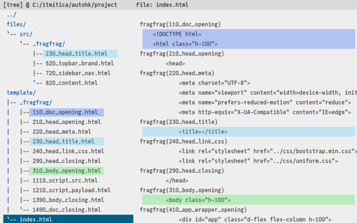
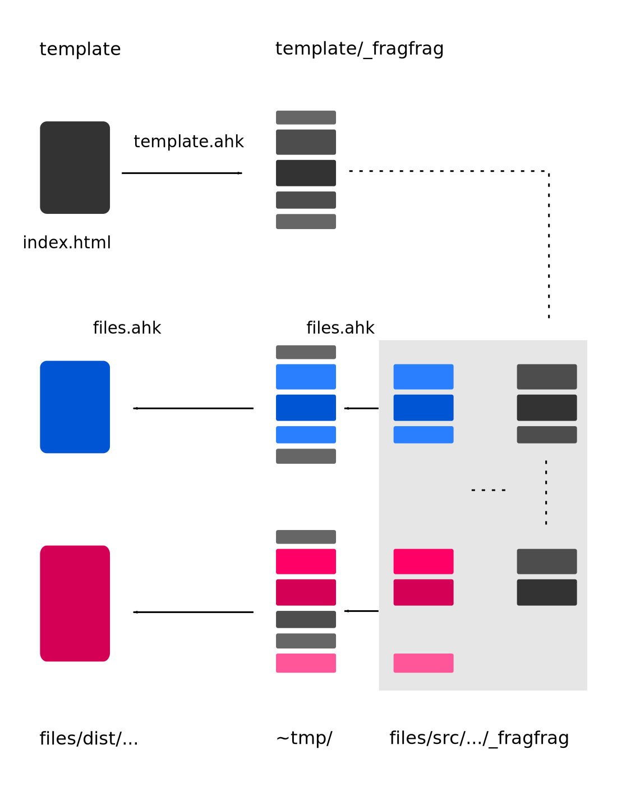

# fragfrag
Split a file into fragments. Copy the fragments to a new location and modify them. Reassemble original fragments and modified fragments into a new file at the new location.

## A picture before the thousand words

## How to organize the files
Create a new directory with a `template` subdirectory in it and a `files\src` subdirectory structure as well. Copy the `index.html` template file in the `template` subdirectory.

## How to split into fragments
### Fragmentation points
Define fragmentation points in the `index.html` template file: insert `fragfrag(number_description)` lines in the template file. This is up to you, you set the rules of fragmentation. `number` is required. Any numbered sequences will do, but keep an ascending order. `description` is not required but may be really useful with recognizing the content in the file fragment.

### Fragmentate
Run `AutoHotkeyU32.exe path/to/fragfrag/template.ahk path/to/project` to generate a `_fragfrag` directory and the file fragments from the template file.

### GUI
You can also run `AutoHotkeyU32.exe path/to/fragfrag/gui.ahk`, choose the working `project` directory path, select the `template` option from the script list and press the `Run` button.

You can also copy `AutoHotkeyU32.exe` as `path/to/fragfrag/gui.exe` and duble click `gui.exe`. It will run `gui.ahk` by default.

### U64
You can use `AutoHotkeyU64.exe` instead, if you want.

## How to reassemble fragments
### Copy, modify, add fragments
Copy file fragments that will differ in content to a `_fragfrag` location in `path/to/project/files/scr` directory. For example, to `path/to/project/files/src/_fragfrag`. Add/remove content to each fragment. This is, again, up to you. You control the rules of fragmentation, so you control the rules of substitution as well.

### Add new fragments
If you need, add new numbered fragments in between the existing fragments, if needed.

### Reassemble
Run `AutoHotkeyU32.exe path/to/fragfrag/files.ahk path/to/project` to generate a `dist` directory and new `index.html` files, from the template fragments, and from the fragments you chose to modify in the `_fragfrag` directory from each subdirectory in `files/src`.

## A picture after a thousand words
### Workflow concept

