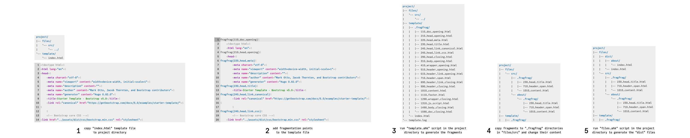
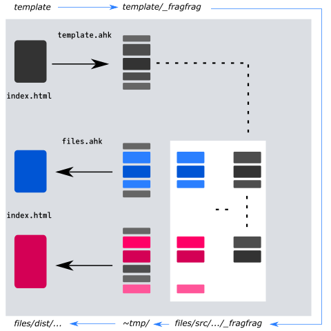

# fragfrag
## The problem
How do I break a template file into pieces and use those pieces to assemble other files?

## A picture before a thousand words

Check the `samples` directory.

## The workflow
Split a file into fragments. Copy some of those fragments to a new location and modify them. Reassemble original fragments and modified fragments into a new file at the new location. Repeat to create as many files are needed using the template fragments.

## How to organize the files
Create a new directory, e.g. `project`, with a `template` subdirectory in it and a `files\src` subdirectory structure as well. Copy your `index.html` template file in the `template` subdirectory.

For the following documentation, it is assumed that `fragfrag` has been copied to `c:\fragfrag` and the project directory is `c:\project`.

## How to split the template into fragments
### Fragmentation points
Define fragmentation points in the `index.html` template file: insert `fragfrag(number_description)` lines in the template file. This is up to you, you set the rules of fragmentation. `number` is required. Any numbered sequences will do, but keep an ascending order. `description` is not required but may be really useful with recognizing the content in the file fragment.

#### How to sequence the numbers
I separate template content in contexts: doc, head, body. I further separate each context into smaller contexts: meta, title, css, js, main content. And so on, until I have defined a context structure fit for my purpose. Hence, each template file could have a different context structure.

I use hundreds as stepping points from the previous context: 100, 200 and so on. I use tens as stepping points for fragments inside a context so that I can add fragments in between later. I start a context from ten and end a context with ninety: e.g. 110 to 190. This way I can add fragments to that respective context, before its very beginning or after its very ending, when needed: e.g. 105 or 195.

If contexts are nested, then for the outer nested context it's not possible to use the same hundreds for its end. So I just step up on the hundreds to point out the new context switch, from the inner context to the outer context, and then put directly the ninety: e.g. [110 [210 220 290] 390].

### Fragmentate
Run `AutoHotkeyU32.exe c:\fragfrag\template.ahk c:\project` to generate a `c:\project\template\_fragfrag` directory and the file fragments from the template file.

### GUI
You can also run `AutoHotkeyU32.exe c:\fragfrag\gui.ahk`, choose the working `c:\project` directory path, select the `template` option from the script list and press the `Run` button.
You can also copy `AutoHotkeyU32.exe` as `c:\fragfrag\gui.exe` and duble click `gui.exe`. It will run `gui.ahk` by default.

### U64
You can use `AutoHotkeyU64.exe` instead, if you want.

## How to reassemble fragments into different files
### Copy, modify, add fragments
Copy file fragments that will differ in content from the fragments in the template file, to `_fragfrag` locations in `c:\project\files\src` directory. For example, to `c:\project\files\src\_fragfrag` for a root `c:\project\files\dist\index.html` file and `c:\project\files\src\about\_fragfrag` for a `c:\project\files\dist\about\index.html` file.

Add/remove content to fragments. This is, again, up to you. You control the rules of fragmentation, so you control the rules of substitution as well.

### Add new fragments
Optionally, add new numbered fragments in between the existing fragments, if the fragments from the template file are not fit for the content you wish to add.

### Reassemble
Run `AutoHotkeyU32.exe c:\fragfrag\files.ahk c:\project` to generate a `dist` directory and new `index.html` files, using the template fragments, and the modified or added fragments in the `_fragfrag` directory from each subdirectory in `c:\project\files\src`.

